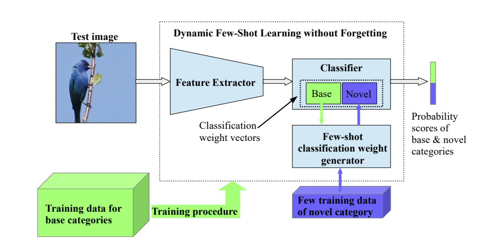
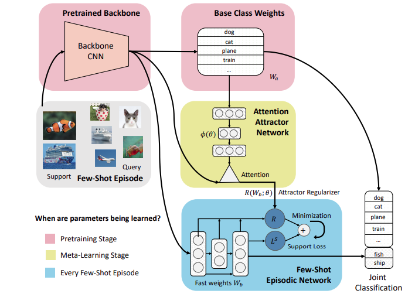
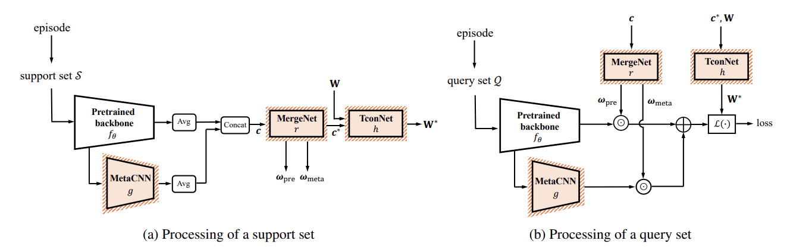
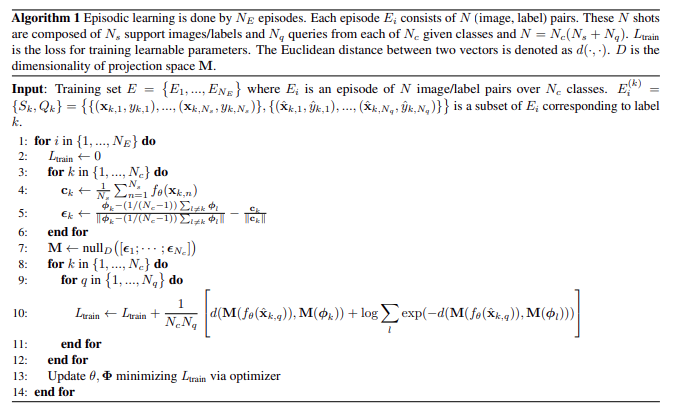
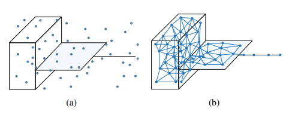
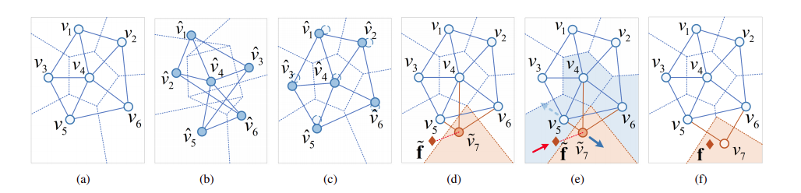

## What is Few Shot Learning?

The human visual system exhibits the remarkable ability to effortlessly learn novel concepts from only one or a few examples and reliably recognize them later on. I think the human visual system is so efficient when learning novel concepts because it exploits its past experiences about the (visual) world. For example: As humans, we have an excellent representation of the world; we only need a few samples to identify a car or a building. Mimicking this behaviour on an Artificial Intelligence system is called Few-Shot Learning. This research area is exciting and challenging with many practical, real-world applications, including real-time vision interactive applications.

## What is Incremental Learning?

Incremental Learning refers to a family of scalable algorithms that learn to sequentially update models from infinite data streams. Whereas in “traditional” machine learning, we’re given a complete dataset consisting of (input, output) pairs, in Incremental Learning, we don’t have all of the data available when creating the model. Instead, the data points arrive one at a time, and we have to build a “living” model, one that learns and adapts as the data comes. 

*The aim of the article to understand the state of the art techniques in Incremental Few-Shot Learning (IFSL) like:*

- Dynamic Few-Shot Visual Learning without Forgetting
- Incremental Few-Shot Learning with Attention Attractor Networks
- XtarNet: Learning to Extract Task-Adaptive Representation for Incremental Few-Shot Learning
- Few-Shot Class-Incremental Learning
- Incremental Few-Shot Learning via Vector Quantization in Deep Embedding Space

## Dynamic Few-Shot Visual Learning without Forgetting (CVPR 2018)

Most prior research methods neglected two essential characteristics of few-shot learning:

- Learning of novel categories (new categories that are not available during training time) needs to be fast
- Do not sacrifice any recognition accuracy on the base categories (the initial categories the model was trained on) 

This work, Dynamic Few-Shot Visual Learning without Forgetting motivated based on the above shortcoming, developed an object recognition learning model that not only able to recognize the base categories but also dynamically learns to recognize the novel categories from only a few training samples (usually 1 to 5 ).  The authors achieved state-of-the-art results on few-shot learning by proposing :

- An Attention based few-shot classification weight generator
- Implement ConvNet classifier Model as a cosine similarity (instead of dot product) function between feature representations and classification vectors. 

### Architecture Overview

> Overview of our system. It consists of: (a) a ConvNet based recognition model (that includes a feature extractor and a classifier)
and (b) a few-shot classification weight generator. Both are trained on a set of base categories for which we have available a large set of
training data. During test time, the weight generator gets as input a few training data of a novel category and the classification weight
vectors of base categories (green rectangle inside the classifier box) and generates a classification weight vector for this novel category (blue
rectangle inside the classifier box). This allows the ConvNet to recognize both base and novel categories.

### Observations:

- Few-Shot Learning is not feasible with a typical dot-product-based Classifier because we need to train both base and novel categories separately. On the other hand, Cosine-Similarity based Classifier unified the learning process of both base and novel categories.
- Cosine-Similarity based Classifier leads the feature extractor to learn features that generalize significantly better on novel categories than features learned with the dot-product based Classifier.
- Thanks to the Cosine-Similarity based Classifier, the base classification weight vectors learn to be representative feature vectors of their categories. Thus, the base classification weight vectors also encode visual similarity. 
- Using an attention-based weight composition, the classification weight vector of a novel category can be composed as a linear combination of those base classification weight vectors that are most similar to the few training examples of that category. Attention-based weight composition allows our few-shot weight generator to explicitly exploit the acquired knowledge about the visual word (here represented by the base classification weight vectors) to improve the few-shot recognition performance. 

Refer to [Dynamic Few-Shot Visual Learning without Forgetting](https://arxiv.org/pdf/1804.09458.pdf) for detailed methodology, results and comparisons.

## Incremental Few-Shot Learning with Attention Attractor Networks (NIPS 2019)

The authors presented a novel method for incremental few-shot learning where during meta-learning, the authors optimized a regularizer that reduces catastrophic forgetting from the incremental few-shot learning. The proposed regularizer is inspired by [attractor networks](http://proceedings.mlr.press/v80/liao18c/liao18c.pdf) and can be thought of as a memory of the base classes, adapted to the new classes. They also showed how this regularizer could be optimized, using [recurrent back-propagation](https://home.cs.colorado.edu/~mozer/Research/Selected%20Publications/reprints/ZemelMozer2001.pdf) to back-propagate through the few-shot optimization stage. During each few-shot episode, we directly learn a classifier network that is randomly initialized and solved till convergence, unlike Dynamic Few-Shot Visual Learning without Forgetting which directly outputs the prediction. 

### Architecture Overview

> The proposed attention attractor network for incremental few-shot learning. During
pretraining we learn the base class weights Wa and the feature extractor CNN backbone. In the
meta-learning stage, a few-shot episode is presented. The support set only contains novel classes,
whereas the query set contains both base and novel classes. We learn an episodic classifier network
through an iterative solver, to minimize cross entropy plus an additional regularization term predicted
by the attention attractor network by attending to the base classes. The attention attractor network is
meta-learned to minimize the expected query loss. During testing an episodic classifier is learned in
the same way.

Incremental Few-Shot Learning with Attention Attractor Networks has several stages: 

- **Pre-training stage**: We learn a base model for the regular supervised classification task on the dataset. The purpose of this stage is to learn both a good base classifier and a good representation. The parameters of the base classifier are learned in this stage and will be fixed after pre-training.

- **Incremental Few-Short Episodes**: A few-shot dataset can be the same data source as the pre-training dataset but sampled episodically from which we can sample few-shot learning episodes. In each episode, we learn a classifier on the support set whose learnable parameters are called the fast weights, as they are only used during this episode.

- **Metra-Learning Stage**: The authors iteratively sample few-shot episodes and learn the meta-parameters to minimize the joint prediction loss*. In particular, we design a regularizer* using Attention Attractor Networks such that the fast weights are learned via minimizing the loss, which typically a cross-entropy loss for a few-shot classification.

> Join Prediction Loss and Attention Attractore Networks Regularizer details are explained clearly in the [Incremental Few-Shot Learning with Attention Attractor Networks](https://arxiv.org/pdf/1810.07218.pdf) paper. 

### Algorithm 

### Summary 
> In short, the authors proposed an **Attention Attractor Network** model, which regulates a per-episode training objective by attending to the set of base classes. The authors showed that the *meta-learning iterative model solves the few-shot objective until convergence is better than baselines that do one-step inference*. They also showed *recurrent back-propagation is an effective and modular tool for learning in a general meta-learning setting*, whereas truncated back-propagation through time fails to learn functions that converge well.

## XtarNet: Learning to Extract Task-Adaptive Representation for Incremental Few-Shot Learning (ICML 2020)

The above-mentioned CVPR 2018 and NIPS 2019 paper focused on extracting a fixed representation from the pretrained backbone rather than exploring novel representations that could be task-adaptive. The authors' main motivation is to pursue novel knowledge from new experience and merge it with prior knowledge learned from previous experience. 

The authors proposed Xtar-Net, which learns to construct novel representation with informative features to classify both base and novel categories. In addition to a pretrained feature extractor like the CVPR 2018 and NIPS 2019 paper, Xtar-Net method employs extra modules that are meta-trained across varying episodes to accomplish the following:

- Built on a pretrained model, the proposed method XtarNet employs three essential modules that are meta-trained.
- For a given new task, XtarNet extracts novel features that the pretrained backbone cannot capture. 
- The novel feature is then combined with the base feature captured by the backbone
- The mixture of these features constructs Task-Adaptive Representation (TAR), facilitating incremental few-shot learning.
- The base and novel classifier quickly adapt to the given task by utilizing TAR.

 TAR can be used in conjunction with known incremental few-shot learning methods like CVPR 2018 or NIPS 2019 and can achieve significant performance gains. The authors use [TapNet](https://arxiv.org/pdf/1905.06549.pdf), which is a relatively simple but effective few-shot learning method. TapNet utilizes meta-learned perclass reference vectors for classification in a task-adaptive projection space.
 
 ### Architecture Overview

> Overiew is clearly explained in the [XtarNet](https://arxiv.org/pdf/2003.08561.pdf) paper. Please read it for details

### Task-Adaptive Projection for Few-Shot Learning Algorithm

## Few-Shot Class-Incremental Learning (CVPR 2020)

The authors address Few-Shot Class-Incremental Learning  (FSCIL) from a novel, cognitive-inspired perspective of Knowledge Representation. *Recent discoveries in cognitive science reveal the importance of topology preservation for maintaining the memory of the old knowledge. The change of the memory's topology will cause severe degradation of human recognition performance on historical visual stimuli, indicating catastrophic forgetting*. Typically **[Knowledge Distillation](https://arxiv.org/pdf/1503.02531.pdf)** was used to mitigate Castostropic Forgetting problem. 

The authors presented  **TOpology-Preserving knowledge InCrementer (TOPIC)**. TOPIC uses a **[Neural Gas (NG) network](https://papers.nips.cc/paper/1994/file/d56b9fc4b0f1be8871f5e1c40c0067e7-Paper.pdf)** to model the topology of feature space. When learning the new classes, NG grows to adapt to the change of feature space. NG maps the feature space to a finite set of feature vectors (F) and preserves the topology of F by **competitive Hebbian learning**.

> **Comparisons of two ways to characterize a heterogenous manifold.** (a) Randomly sampled representatives, which are
adopted by conventional CIL studies for knowledge distillation.
(b) The representatives learned by neural gas, which well preserves the topology of the manifold.

> **NG preserves the topology of heterogenous feature
space manifold.** Initially, NG is learnt for base classes (the blue
dots and lines.) Then NG incrementally grows for new classes by
inserting new nodes and edges (the orange dots and lines.) During the competitive Hebbian learning, v_j ’s centroid vector m_j is
adapted to the input vector f which falls in F_j encoded by v_j .

The authors formulated FSCIL as an optimization problem with two objectives.

- **Avoid catastrophic forgetting**; TOPIC preserves the old knowledge by stabilizing the topology of NG, which is implemented with an **[Anchor Loss (AL)](https://openaccess.thecvf.com/content_ICCV_2019/papers/Ryou_Anchor_Loss_Modulating_Loss_Scale_Based_on_Prediction_Difficulty_ICCV_2019_paper.pdf)** term.
- **Prevent overfitting to few-shot new classes**; TOPIC adapt the feature space by pushing the new class training sample towards a correct new NG node with the same label and pulling the new nodes of different labels away from each other. The **min-max loss (MML)** term is developed to achieve this purpose.

> **Explanation of NG stabilization and adaptation.** (a) NG divides CNN’s feature space F into a set of topologically arranged
subregions Fj represented by a centroid vector vj . (b) When finetuning CNN with few training examples, F’s topology is severely
distorted, indicating catastrophic forgetting. (c) To maintain the topology, the shift of NG nodes is penalized by the anchor-loss term. (d)
NG grows for new class y by inserting a new vertex v˜7. A new class training sample ˜f is mismatched to v5, due to d(
˜f, m5) < d(
˜f, m7).
(e) The min-max loss term adapts F7 by pushing ˜f to v˜7 and pulling v˜7 away from the neighbors v4, v5 and v6. (f) The topology is updated
after the adaptation in (e), where v˜7 has been moved to v7, and the connection between v4 and v7 is removed due to expired age.

Refer to [Few-Shot Class-Incremental Learning](https://arxiv.org/pdf/2004.10956.pdf) for detailed methodology, results and comparisons.

## Incremental Few-Shot Learning via Vector Quantization in Deep Embedding Space (ICLR 2021)

The authors proposed a **nonparametric method to handle incremental few-shot learning based on Learning Vector Quantization (LVQ).**  By doing this, the adverse effects of imbalanced weights in a parametric classifier can be avoided entirely. 

### Learning Vector Quantization (LVQ)

>  LVQ is a classical data compression method that represents knowledge through a few learned reference vectors. A new sample is classified to the same label as the nearest reference vector in the input space.

> LVQ has been combined with deep feature extractors as an alternative to standard neural networks for better interpretability.

LVQ is a nonparametric method that is well suited for incremental few-shot learning because the model capacity grows by incorporating more reference vectors to learn new knowledge. For example, Incremental Learning Vector Quantization (ILVQ) has been developed to learn classification models adaptively from raw features. The proposed method does not rely on predefined rules to update reference vectors and can be learned along with deep neural networks in an end-to-end fashion.

### Incremental Deep Learning Vector Quantization (IDLVQ)

The general framework of IDLVQ for both classification and regression can be derived from a [Gaussian Mixture](https://www.cse.iitk.ac.in/users/piyush/courses/pml_winter16/IncompleteDataEM.pdf) perspective, with a **simplified covariance structure and supervised deep representation learning**. The proposed IDLVQ is a *nonparametric method as it makes a prediction based on similarity to reference vectors instead of using any regression or classification weights. The model's capacity grows naturally by adding more reference vectors to learn novel tasks, while the old knowledge is preserved in existing reference vectors.*

### Contributions
- A unified framework is developed, termed incremental deep learning vector quantization (IDLVQ), to handle both incremental classification (IDLVQ-C) and regression (IDLVQ-R) problems.
- Developed intra-class variance regularization, less forgetting constraints and calibration factors to mitigate catastrophic forgetting in class-incremental learning
- The proposed methods achieve state-of-the-art performance on incremental few-shot classification and regression datasets. 

Refer to [Incremental Few-Shot Learning via Vector Quantization in Deep Embedding Space](https://openreview.net/pdf?id=3SV-ZePhnZM) for detailed methodology, results and comparisons.
