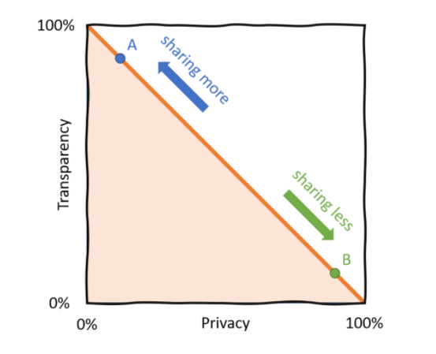
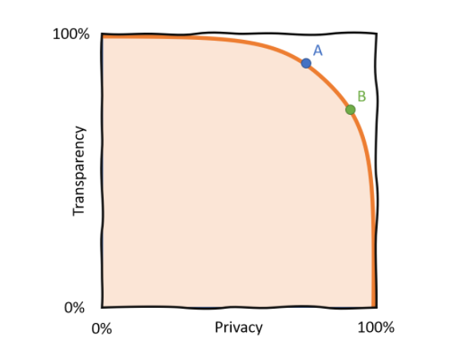

The main topic of the article is the **privacy-transparency trade-off** and how it affects a huge number of issues. This article walks through some of the most important challenges to society and *identifies how the privacy-transparency trade-off underpins them*. Improving information flows, by solving this trade-off, can help us in many areas like disinformation, scientific innovation, and even democracy itself.

> Every part of the human experience is soaked in information flows. Since the beginning of human collaboration.

We share our medical information with our doctor. We share our location with an app to get directions. We share our heart rates and sleeping patterns in hopes of improving our well-being. Every day, we share personal information to exchange goods, receive services, and in general, to collaborate. Sharing information is a part of almost every aspect of our life.

## Information Flow

What is an information flow? Let's take the simple example of email. A sender, a message, a receiver. Probably one of the most straight-forward information flows. But even email is much more nuanced than just the three attributes sender, message, receiver:

- Should other people than the receiver be allowed to read it?
- Would I be comfortable with the receiver forwarding my email?
- The email provider could probably read it, do I trust them to not do so?
- Do I want the email provider to read my mail only for a specific purpose, like for spam detection, but not for targeted advertising?
- Am I sending my exact identity with the email? Anonymously? Or a mix: as a member of group?
- Do I know exactly who the recipient is? When I'm sending the mail to a doctor's office, who reads it?
- Can the receiver have confidence in the identity of the sender, whaf if my account was hacked?

Questions like these exist around every information flow!

Newly emerging communication channels: **Snapchat** deletes the messages once they've been read and prohibits forwarding or screenshotting. **WhatsApp** or **Signal** use end-to-end encryption for messages so it's impossible for anyone other than the intended recipient to read them. *Users switch to these services because of seemingly tiny changes to the guarantees around information flow.* I feel like, this is the beginning of a new revolution!!!

> An information flow is a flow of bits from a sender to a receiver. The sender and receiver could either be an exact individual, a member of a group, or an anonymous individual. The identity of the sender, the receiver, and the content of the message itself can be probabilistic.

## What is Privacy??

*Privacy is not about secrecy*. People feel that their privacy is violated if information flows in a way they didn't expect. It's all about the **appropriate flow of information, not about the information itself.**

>  Privacy means the ability to ensure information flows that are according to social norms

Example: Google Street View: why are people having trouble with Google taking photos of them in their front yard, when anybody could come by and see them exactly there? Because *when public information becomes so much more public, it bothers us*.

> [Contextual Integrity](https://en.wikipedia.org/wiki/Contextual_Integrity): sharing the same information might be private in one context, but not in another context. It’s about achieving appropriate information flow.

Example: My face is considered public information as soon as I leave the house, because anybody can see it. So why is facial recognition software so troubling? Not only because it could be misused (i.e., for mass surveillance), but because it is identification without my consent. The information flow is not triggered by me, but by whatever system is watching me.

## Analogy: Data is Fire

There are several analogies for Data like [Data is the New Oil](https://www.forbes.com/sites/forbestechcouncil/2019/11/15/data-is-the-new-oil-and-thats-a-good-thing/?sh=6b1e35e37304). A better analgoy would be [Data is Fire](https://ystrickler.medium.com/data-is-fire-92a110557ef8).

- Data can be duplicated (Infinite timess!!!)
- Data can help us prosper and solve problems
- Data can cause irreparable damage if misused

Data is like a double edge sword, its true for all kinds of data, not just senstive data like **healthcare data or financial data**.

>  When I bring a topic like Privacy with my friends, they usually say *I don't have anything to hide, so why would I care about Privacy*. But, in my opinion that's not true - **Everything is a Private Data**.

## Every Data is a Private Data

Your grocery shopping list is boring, right? Not always. *You might not care now whether somebody knows you're buying bread.* But when you suddenly stop buying bread (and other carbs), it might be an indication of the diagnosis of diabetes. *Suddenly it's very private information that you might not want to share.*

Well you can say, we can **annonymize the data**. Anonymization seems like the obvious solution to protect the identities of people in data, this does not work reliably in real-world data. *Thanks to the power of Machine Learning, even when names are removed from data, other features can be used to identify you.*

And even when your exact identity is not recoverable, data can be used for **targeting**: As long as someone is able to reach you (via your browser, your email, your neighborhood, your university, etc ...), **your name is not at all necessary to do harm.**

> **Annonymization** does not **WORK**

Example: Anonymization works so badly, that the attackers can systematically exploit its weaknesses and make it as a business model. For example, couple of years ago Guardian post published an [article](https://www.theguardian.com/technology/2017/jan/10/medical-data-multibillion-dollar-business-report-warns) on **Your Private Medical Data is for Sale**. Several US company that buys anonymized health data and distributes **"market insights"** from it to insurance companies. They can then, for example, avoid selling insurance to high-risk communities like poor neighborhoods, where people are more likely to get sick.

Also, read this article on [Strava](https://medium.com/strava-engineering/the-global-heatmap-now-6x-hotter-23fc01d301de) releasing an anonymized heatmap of network of athletes activities that revealed the location of US military bases. So, *privacy can be relevant not only on an individual level but on an organizational or even national security level.*

## Privacy and Transparency Dilemmas

Due to the potentially harmful use of data, we have to constantly make trade-offs and decide whether to share information, weighing the benefits and the risks.

> A privacy dilemma is a trade-off whether or not to reveal information, where revealing that information causes some social good (like advances in medical research) but could also lead to harm (like the misuse of medical data).

Privacy dilemmas have various costs. The most obvious is a privacy violation where data is shared in good faith but the information is misused. On the other hand, there are societal costs when information instead is kept secret: a failure to accomplish important outcomes of information flow (scientific progress, meaningful relationships, accountability).

> A transparency dilemma is when someone is forced to make a decision without having access to the information they need to make it.

Sometimes the necessary information flows don't exist at all (trusting a stranger to fix your tire), sometimes they exist but their content is not verified (online reviews).

Stopping all information flow and locking all data is not the solution to the privacy issue. This would prevent good use of data (think medical care, climate research) and also make undesirable behaviour easier (money laundering, lack of accountability). Maximizing privacy could lead to a lack of transparency!

## The Privacy-Transparency Pareto Frontier

We used to have a classic [Pareto trade-off](https://en.wikipedia.org/wiki/Pareto_efficiency) between privacy and transparency. You had to decide whether you share information at the cost of privacy (point **A** in the chart). Or whether you keep information private, but at the cost of transparency (**B**). The question is: how can we move the frontier of this trade-off and have more of both at the same time?

With new technologies, we can actually move the pareto frontier. Notice that point B in this chart has the same amount of privacy as in the first chart, but has a lot more transparency.

We don't have a zero-sum game anymore! This will affect every industry handling valuable, sensitive, or private data.

Thanks to these technologies, in the future governments won't have to choose between preserving the privacy of their citizens or protect national security, they can do both. Researchers won't have to decide whether or not to share their data, they can have the benefits from both. Corporations currently often have to choose between the privacy of their users and the accuracy of their products and services, in the future they can have both.

## Why We Need to Solve the Privacy-Transparency Trade-Off

### Research is Constrained by Information Flows

If there was a way to share data across institutions while making sure it remained private and was used for good, all areas of research would benefit. More data would be available, it would be available faster, and also: experiments could be replicated more easily.

### Healthy Market Competition for Information Services

Most services that handle your data will profit from locking you in. Because of privacy concerns they are inherently anti-competitive. More privacy restrictions can actually make it harder for new companies to compete (because you can't move your data from your old to the new provider).

We need more interoperability between information service providers.

> Interoperability means you can buy your shoes from one company and your socks from another. In information services it also means that you should be able to move to a different company and take your data with you.

Example: Facebook actually started as a company that profited a lot from interoperability. One reason it gained popularity was that users from its established main competitor MySpace could connect their accounts with Facebook and still message with their friends on the old platform. Without this feature, probably less people would have switched to the new platform. This is called adversarial interoperability.

> The [GDPR](https://en.wikipedia.org/wiki/General_Data_Protection_Regulation) (General Data Protection Regulation) was introduced in the EU in 2018 and has the aim to give individuals control over their personal data.

The GDPR is considered a groundbreaking piece of legislation and it is being copied around the world.

*EU citizens now have 7 rights over their data, including the right to be forgotten (a company has to delete all your personal data on request) and the right of access (on request, companies have to send you a copy of all data they have of you).*

> Privacy is not only about preventing information from being shared. Sometimes satisfying privacy is about forcing companies to share or delete your data in a specific way or at a specific time.

### Feedback Mechanisms & Information Flows

We often rely on the opinions of others when we make our decisions. Which car do you buy, which surgeon do you choose for a surgery? But there are more feedback mechanisms. Elections, protests, Facebook likes, going to prison, boycotting, gossip, are all feedback mechanisms.

> Feedback mechanism: Someone does something, and later gets positive or negative feedback from those affected by their actions.

Feedback mechanisms help us understand how the world views our work, so we can do more good things and fewer bad things. They are essential to society's function and unfortunately, due to the privacy-transparency trade-off, many of them are quite broken. This is the case when feedback information is too sensitive or valuable to be shared.
What does a broken feedback scenario look like?

Examples:

- **Medical care**: When you go for surgery, how good is your surgeon? Can you ask for reviews of previous patients, could you talk to previous nurses? And even if you could, could you talk to enough patients or nurses?
- **Consumer products**: How do you know whether a product is any good? Amazon reviews are easy to fake, and the real ones come from only the most polarized users.
- **Politics**: A multiple choice question between a few candidates every 4 years is a terrible feedback system for reviewing the legislature of the past 4 years.

Most feedback information simply isn't collected, because it would be too personal to collect it.

### New Market Incentives

Today's incentives of companies are often misaligned with the well-being of their users.

Example: Many online companies use attention (often called engagement) as their key metric. For some this intuitively makes sense, because their revenue is ad-driven. But even companies that run on a subscription model, like Netflix, do it. Netflix's former CEO Reed Hastings famously said they are competing with sleep (["And we’re winning!"](https://www.fastcompany.com/40491939/netflix-ceo-reed-hastings-sleep-is-our-competition)). The question is: why?

One answer is that it's a readily available metric which is fine-grained and allows for optimization. Netflix's number of subscribers - which is the number they actually care about - is too coarse to use as a metric. Only if a movie was so good or so bad that it made users subscribe/unsubscribe, it would have a measurable effect.

Attention as a metric does work and is probably not a problem when used at a small scale. But at large scale and taken to the extremes it can cause harm, see the Netflix/sleep example.

Let's speculate about a better approach: Netflix could try to optimize their experience to improve the users' sleep. But how would they measure it and train an algorithm on it? Fitbits track sleeping patterns, but is it safe to share this data with Netflix? In general, these alternative metrics are called wellness metrics and can improve our lives.

But we need to solve the privacy-transparency trade-off. And there are many more areas where privacy-transparency trade-off will make a huge difference

- Data, Energy & the Environment
- Democracy & Public Health Conversation
- Safe Data Networks for Business, Governance and R&D
- Conflict, Political Science & Information Flows
- Disinformation & Information Flows (Example: Fake News)

## Conclusion

The privacy-transparency trade-off or even privacy in general is in service of a higher aim: creating information flows within society that create social good.

> Privacy technology is not just about more privacy.

Don't just look for use cases that scream "privacy". Instead, ask yourself: How can society accomplish its goals with less risk, higher accuracy, faster, and with better aligned incentives than ever before, through better flows of information.

> Entrepreneurial opportunities, regulatory opportunities, investing opportunities: It’s not about hiding data; it’s about enabling specific information flows (and just these!) to maximize social good.

*That is the promise of privacy-enhancing technology and has the potential to radically improve every aspect of how we share information.*

I hope this article is somewhat informative and helpful!!!

