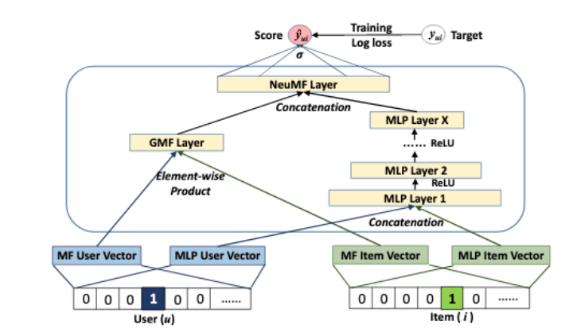

+++
title = "Implicit Feedback Deep Collaborative Filtering Product Recommendation System"
date = 2020-10-01T16:00:00
draft = false

authors = ["Karthik Bhaskar", "Deepa Kundur", "Yuri Lawryshyn"]

# Publication type.
# Legend:

publication_types = ["2"]

# Abstract and optional shortened version.
abstract = "In this paper, several Collaborative Filtering (CF) approaches with latent variable methods were studied using user-item interactions to capture important hidden variations of the sparse customer purchasing behaviours. The latent factors are used to generalize the purchasing pattern of the customers and to provide product recommendations. CF with Neural Collaborative Filtering(NCF) was shown to produce the highest Normalized Discounted Cumulative Gain (NDCG) performance on the real-world proprietary dataset provided by a large parts supply company. Different hyperparameters were tested using Bayesian Optimization (BO) for applicability in the CF framework. External data sources like click-data and metrics like Clickthrough Rate (CTR) were reviewed for potential extensions to the work presented. The work shown in this paper provides techniques the Company can use to provide product recommendations to enhance revenues, attract new customers, and gain advantages over competitors."

abstract_short = "Deep Learning based End to End Recommendation System"

# Is this a featured publication? (true/false)
featured = true

# Projects (optional).
projects = ""
categories = ""
tags = "RecSys"

# Slides (optional).
#   Associate this publication with Markdown slides.
#   Simply enter your slide deck's filename without extension.
#   E.g. `slides = "example-slides"` references 
#   `content/slides/example-slides.md`.
#   Otherwise, set `slides = ""`.
slides = ""

# Links (optional).
url_pdf = "https://arxiv.org/pdf/2009.08950.pdf"
url_preprint = "https://arxiv.org/abs/2009.08950"
url_code = ""
url_dataset = ""
url_project = ""
url_slides = ""
url_video = ""
url_poster = ""
url_source = ""

# Custom links (optional).
#   Uncomment line below to enable. For multiple links, use the form `[{...}, {...}, {...}]`.
# url_custom = [{name = "Github Repo", url = "https://github.com/antaldaniel/eurobarometer/"}]

# Digital Object Identifier (DOI)
doi = ""

# Does this page contain LaTeX math? (true/false)
math = true

# Featured image
[image]
  # Caption (optional)
  caption = "Neural Collaborative Filtering"

  # Focal point (optional)
  # Options: Smart, Center, TopLeft, Top, TopRight, Left, Right, BottomLeft, Bottom, BottomRight
  focal_point = "Center"
+++
<p align="center">
    
    <br>
    <em>Fig: Neural Collaborative Filtering</em>
</p>

# Cite 
Consider citing our work as below, if you find it useful in your research:
```
@misc{bhaskar2020implicit,
    title={Implicit Feedback Deep Collaborative Filtering Product Recommendation System},
    author={Karthik Raja Kalaiselvi Bhaskar and Deepa Kundur and Yuri Lawryshyn},
    year={2020},
    eprint={2009.08950},
    archivePrefix={arXiv},
    primaryClass={cs.IR}
}

```

---

